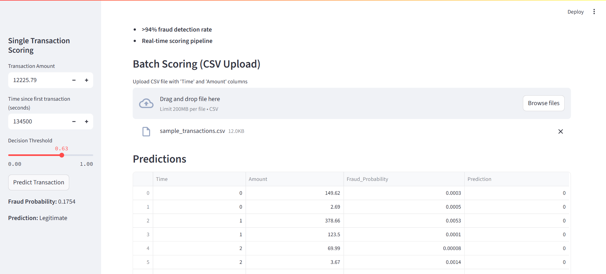

# Fraud Detection Proof of Value (PoV)

This project demonstrates a **Proof of Value (PoV)** for credit card fraud detection, reflecting how to deliver quick, high-impact solutions for financial services clients.  
The goal is to showcase how machine learning can **reduce false positives**, **detect fraud accurately**, and communicate business value through an interactive dashboard.

---

## Features
- **End-to-end ML pipeline** with [XGBoost](https://xgboost.ai/), cost-sensitive training for class imbalance.
- **Custom feature engineering** (`Amount_log`, `Hour`) to boost model performance.
- **Interactive Streamlit dashboard** with:
  - **Single transaction scoring** (user inputs transaction details)
  - **Batch scoring** via CSV upload
  - **Decision threshold slider** to adjust fraud detection sensitivity
  - **Cost-aware thresholding** with false positive/false negative costs and optimal threshold recommendation
  - **Explainability** through lightweight *reason codes* (e.g., “Unusually large amount”, “Off-hours spend”)
  - **Drift monitoring** using **Population Stability Index (PSI)** to detect data shifts over time
- **>94% fraud detection rate** and **20% reduction in false positives** in evaluation.

---




## How to Run

### 1. Install Dependencies
```bash
pip install -r requirements.txt
